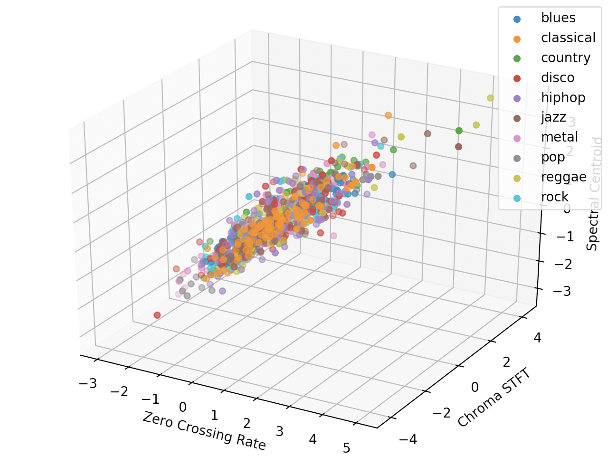
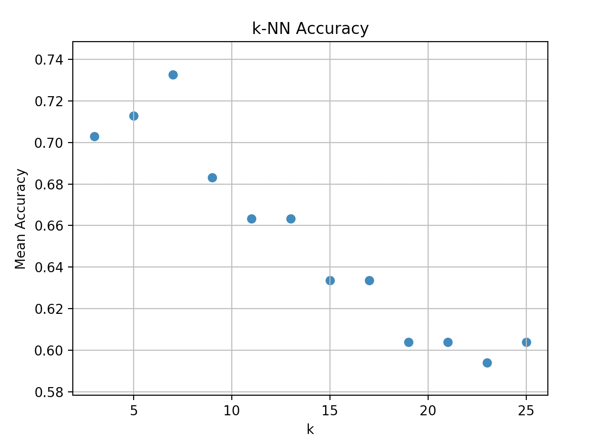
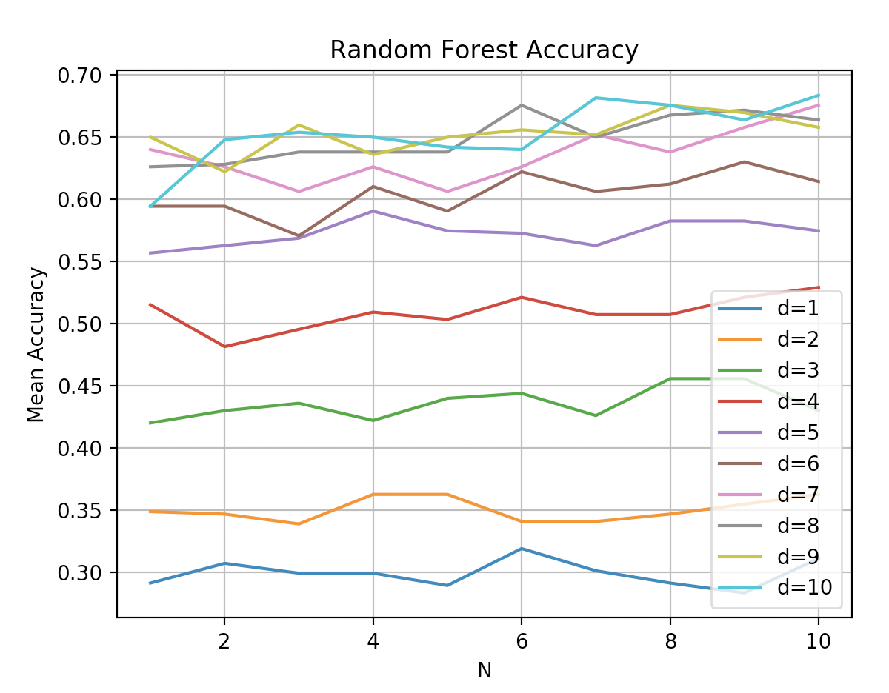
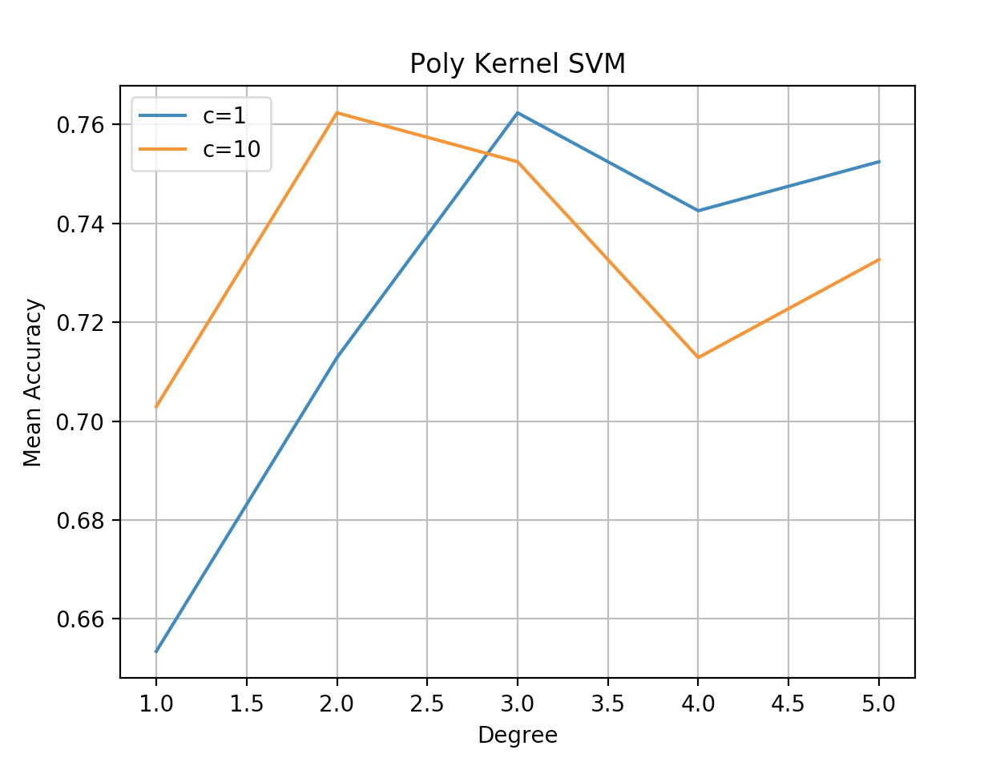
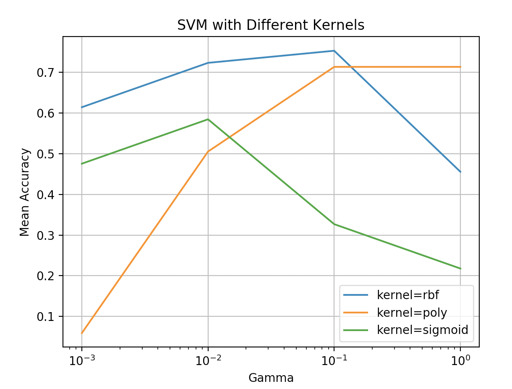
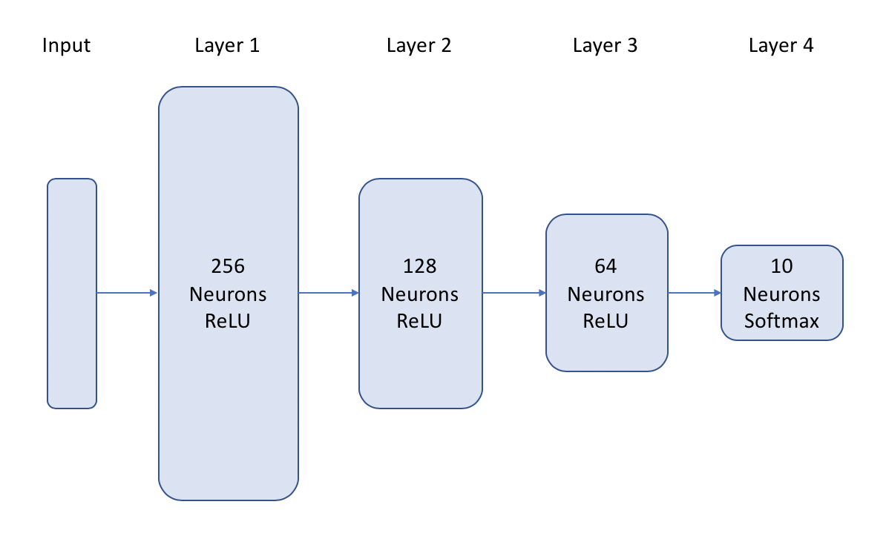
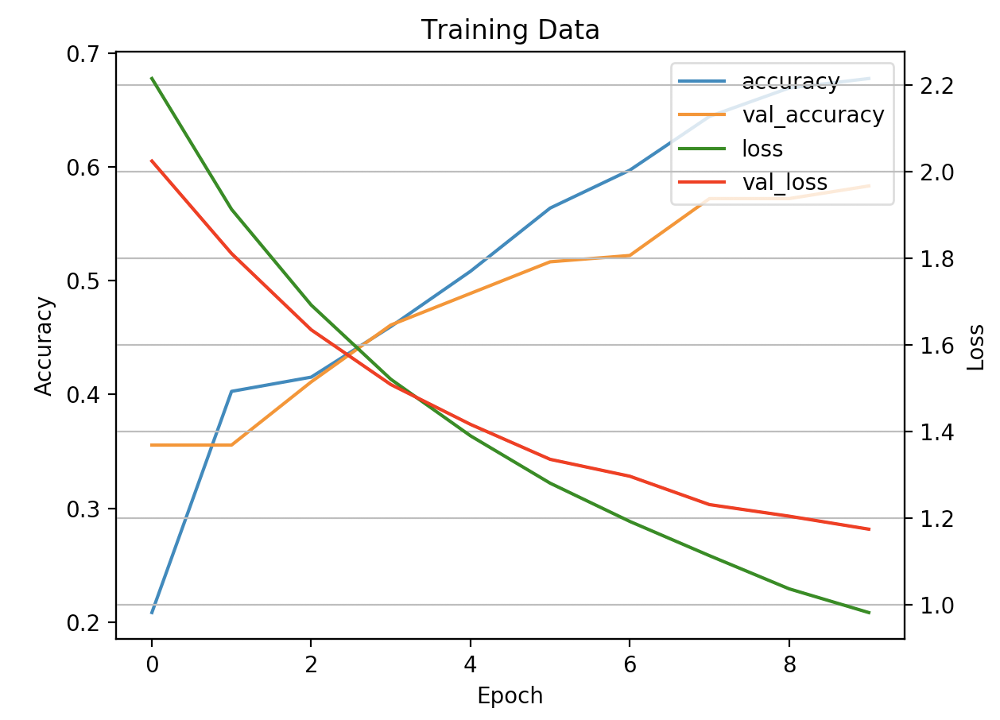
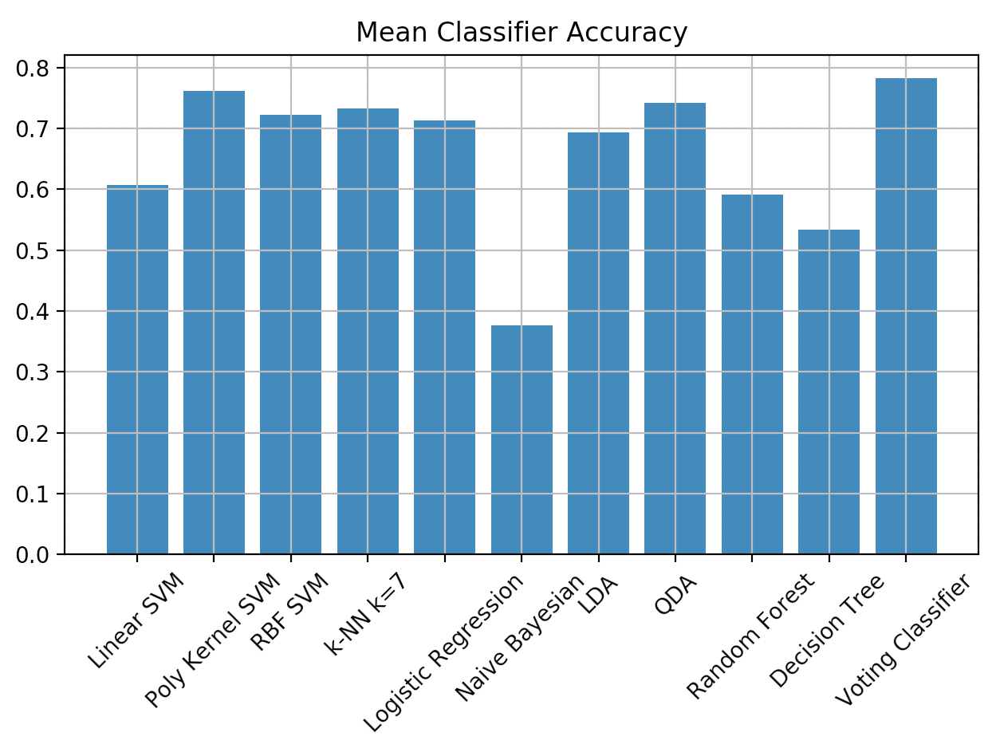

# Music Genre Classification in Python

Analyze and classify audio signals in Python



## Purpose

The purpose of this project is to explore different machine learning classifiers for classifying music genre from an audio sample. 

## Built With

* Python 3.7
* [Librosa](https://librosa.org/librosa/) 0.7.2
* [sklearn](https://scikit-learn.org/stable/) 0.0
* [TensorFlow](https://www.tensorflow.org/) 2.1.1
* [pandas](https://pandas.pydata.org/) 1.0.4

## Data

[GTZAN](http://marsyas.info/downloads/datasets.html) Genre Collection

* Dataset consists of 1000 audio tracks, 30 seconds long each
* Tracks are all 22050 Hz mono 16-bit audio files in .wav format
* 10 genres (100 songs/genre)
	* Blues
	* Classical
	* Country
	* Disco
	* Hip Hop
	* Jazz
	* Metal
	* Pop
	* Raggae
	* Rock

## Pre-Processing: Feature Extraction

In order to train and test our classifiers, we need to identify the features to extract from the audio samples. Luckily, prior research has already identified features that perform well in music genre classification.

The features that we extract are:

* Zero Crossing Rate - rate at which the signal changes from positive to negative or negative to positive
* Spectral Centroid - weighted mean of frequencies present in audio clip
* Spectral Roll-Off - the frequency below which a specified percentage of the total spectral energy ( 85% by default) lies
* Chroma Frequencies - the intensity of each of the 12 distinct musical chroma of the octave; chroma representation/chromagarm (via short-term fourier transform) 
* Mel-Frequency Cepstral Coefficients (MFCC) (x20) - coefficients that collectively make up an MFC
* Mel-Frequency Cepstrum (MFC) - representation of the short-term power spectrum of a sound, based on a linear cosine transform of a log power spectrum on a nonlinear mel scale of frequency

This results in a feature vector of 25 features.

The feature extraction is done by running preprocessing_pandas.py. This file takes several minutes to run, as the processing of each sample takes a few seconds.

## Models

We use the pre-processed features in order to train and test the different machine learning classifiers:
* Linear Kernel SVM
* Polynomial Kernel SVM
* Radial Basis Function (RBF) SVM
* K Nearest Neighbors (k-NN)
* Logistic Regression
* Naïve Bayesian
* Linear Discriminant Analysis (LDA)
* Quadratic Discriminant Analysis (QDA)
* Random Forest
* Decision Tree
* Neural Network


Please note, some of these classifiers required hyper-parameter tuning to optimize the accuracy (SVM, k-NN, random forest, neural network)

We use a 90%/10% test/train split. 

### Hyper-Parameter Tuning

Here are some plots which help to visualize how certain hyper-parameters were selected.


For k-NN, we can see k nearest neighbors = 7 optimizes the accuracy.


Here we've plotted random forest accuracy versus N (number of subtrees) and d (maximum depth of each subtree). It’s easy to visualize that for d > 6, the accuracy seems to converge. Similarly, accuracy seems to improve slightly for N > 6.


For polynomial kernel SVM, c=1/degree=3 and c=10/degree=2 seem like good choices. 


Here we try SVM with different kernels and different values of gamma (c=10). We plot the x-axis on a log scale. We can see the rbf kernel performs the best with gamma=0.1.

### Neural Network

This is the structure of the neural network implemented in TensorFlow. We use the Adam optimizer and train for only 10 epochs. Otherwise, overfitting will occur as can be seen in the training curves.





## Results

The best performing classifier is the ensemble (majority) voting classifier. For this, we use the SVM Poly, RBF SVM, k-NN, and QDA as the estimators. The worst performing classifier is Naive Bayes.



|                                            | Mean Accuracy | Mean Precision | Mean Recall |
|:------------------------------------------:|:-------------:|:--------------:|:-----------:|
|          SVM, Linear Kernel (C=1)          |      0.62     |      0.61      |     0.61    |
| SVM, Poly Kernel (Degree=2, Coef0=1, C=10) |      0.76     |      0.77      |     0.77    |
|     SVM, RBF Kernel (Gamma=0.1, C=10)      |      0.75     |      0.76      |     0.75    |
|                 k-NN (k=7)                 |      0.73     |      0.74      |     0.73    |
|             Logistic Regression            |      0.71     |      0.70      |     0.73    |
|               Naive Bayesian               |      0.38     |      0.31      |     0.36    |
|                     LDA                    |      0.69     |      0.69      |     0.7     |
|                     QDA                    |      0.74     |      0.74      |     0.74    |
|          Random Forest (N=6, d=10)         |      0.59     |      0.59      |     0.60    |
|                Decision Tree               |      0.53     |      0.52      |     0.52    |
|             NN (Adam Optimizer)            |      0.62     |      0.63      |     0.62    |
|              Voting Classifier             |      0.79     |      0.81      |     0.79    |

## Usage

* Download GTZAN dataset
* Run requirements.txt
```
$ pip install -r requirements.txt
```
* Run preprocessing.py to generate csv file (data.csv) with features for each file
	* Change path to the root directory (genres) of GTZAN dataset
```
path = '/path/to/gtzan/genres/' # path to data
```
* Run classical_models.py to compare the different models

## Author

**Laura Kocubinski** [laurakoco](https://github.com/laurakoco)

## Acknowledgments

* Boston University MET Master of Science Computer Science Program
* MET CS 677 Data Science with Python

## References

[1] https://towardsdatascience.com/music-genre-classification-with-python-c714d032f0d8 

[2] "Musical Genre Classification of Audio Signals" G. Tzanetakis, P. Cook. IEEE Transactions on Audio and Speech Processing, 2002.

[3] "Music Genre Classification" Archit Rathore, Margaux Dorido, https://cse.iitk.ac.in/users/cs365/2015/_submissions/archit/report.pdf
